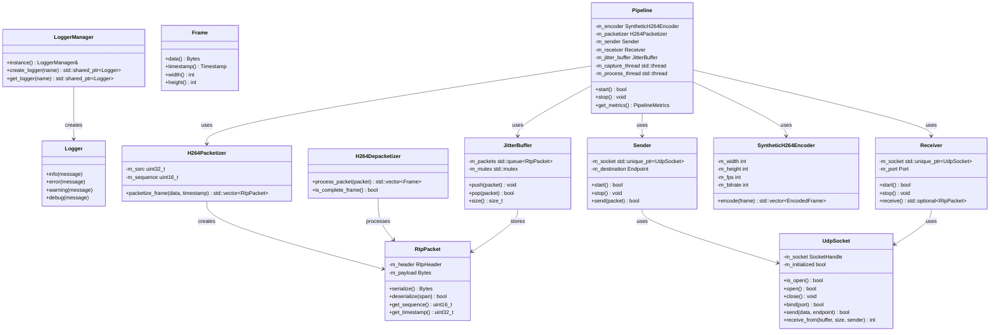

# Module Dependencies Diagram

## Module Structure Overview

```
video_streaming (root namespace)
├── common
│   ├── types (basic types: String, Bytes, etc.)
│   ├── logger (LoggerManager, Logger)
│   ├── interfaces (IReceiver, etc.)
│   └── time (Timestamp, Milliseconds)
├── network
│   ├── endpoint (Endpoint struct)
│   ├── udp_socket (UdpSocket class)
│   ├── sender (Sender class)
│   └── receiver (Receiver class)
├── transport
│   └── rtp
│       ├── packet (RtpPacket class)
│       ├── h264_packetizer (H264Packetizer class)
│       ├── h264_depacketizer (H264Depacketizer class)
│       ├── rtcp (RtcpPacket class)
│       └── rtsp_client (RtspClient class)
├── video
│   ├── media
│   │   ├── frame (Frame, FrameFactory)
│   │   ├── synthetic_encoder (SyntheticH264Encoder)
│   │   ├── ffmpeg_h264_encoder (FFmpegH264Encoder)
│   │   └── rtsp_server (RtspServer)
│   └── jitter
│       └── jitter_buffer (JitterBuffer class)
├── session
│   ├── sender
│   │   └── video_sender (VideoSender class)
│   └── receiver
│       └── video_receiver (VideoReceiver class)
├── async
│   ├── coroutine_types (coroutine utilities)
│   ├── coroutine_frame_generator (frame generation coroutines)
│   ├── coroutine_network_sender (async network sending)
│   └── coroutine_receiver (async receiving)
└── pipeline
    └── pipeline (Pipeline class - main orchestration)
```

## Dependency Graph


## Class Relationship Diagram



## Key Design Patterns

### 1. Module-Based Architecture
- Each logical component is a separate C++20 module
- Clear separation between interface (.ixx) and implementation (.cpp)
- Explicit import dependencies

### 2. Network Layer Abstraction
- `UdpSocket` provides low-level UDP operations
- `Sender` and `Receiver` provide high-level networking
- Clean separation between transport and application logic

### 3. RTP Protocol Implementation
- `RtpPacket` handles serialization/deserialization
- `H264Packetizer` converts H.264 frames to RTP packets
- `H264Depacketizer` converts RTP packets back to frames

### 4. Video Processing Pipeline
- `Frame` represents video data
- `SyntheticH264Encoder` generates test H.264 streams
- `JitterBuffer` handles network packet reordering and loss

### 5. Orchestration
- `Pipeline` coordinates all components
- Multi-threaded capture and processing loops
- Clean lifecycle management (start/stop)

## Module Import Hierarchy

```
Level 1 (Foundation):
├── video_streaming.common.types
├── video_streaming.common.time
└── video_streaming.common.logger

Level 2 (Basic Services):
├── video_streaming.common.interfaces
├── video_streaming.network.endpoint
└── video_streaming.network.udp_socket

Level 3 (Transport):
├── video_streaming.network.sender
├── video_streaming.network.receiver
├── video_streaming.rtp.packet
└── video_streaming.media.frame

Level 4 (Protocol):
├── video_streaming.rtp.h264_packetizer
├── video_streaming.rtp.h264_depacketizer
├── video_streaming.media.synthetic_encoder
└── video_streaming.jitter

Level 5 (Application):
├── video_streaming.session.sender.video_sender
├── video_streaming.session.receiver.video_receiver
└── video_streaming.async.*

Level 6 (Orchestration):
└── video_streaming.pipeline
```

This modular design ensures:
- **Clear dependencies**: Each module only imports what it needs
- **Fast compilation**: Modules can be compiled independently
- **Maintainability**: Changes are isolated to specific modules
- **Testability**: Individual modules can be unit tested
- **Reusability**: Modules can be reused in different contexts
